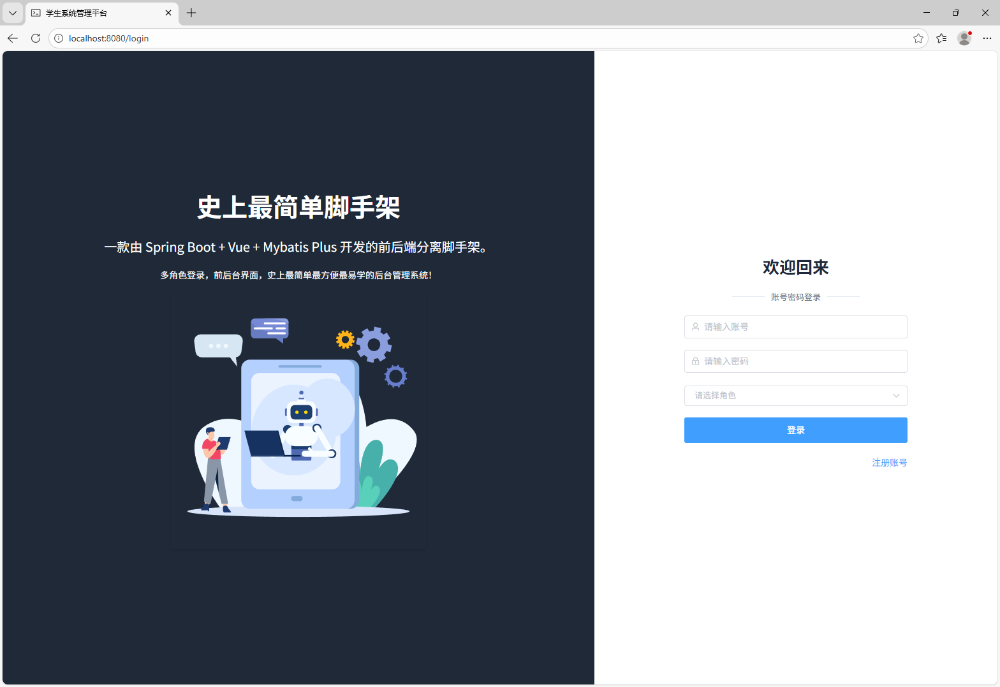
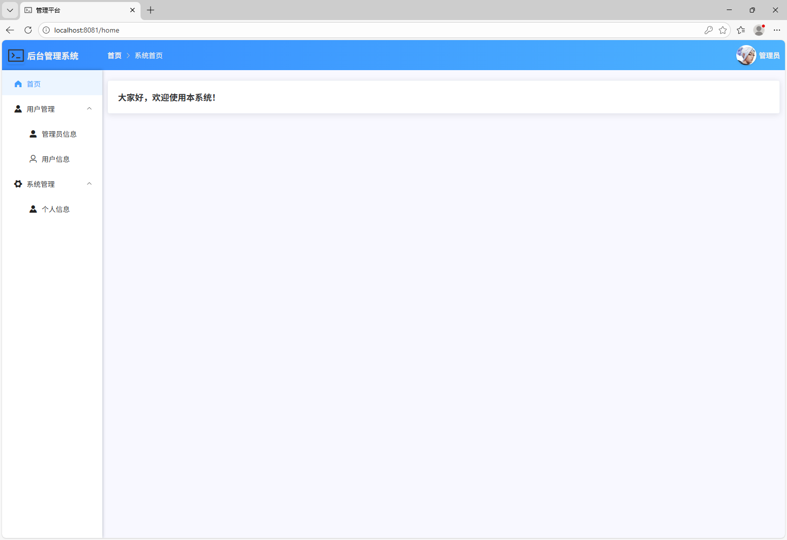
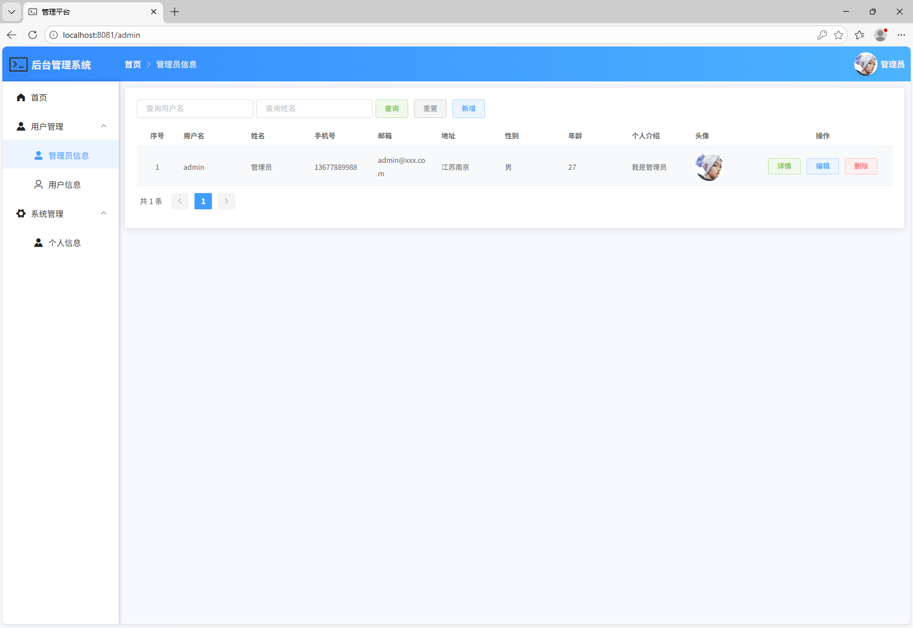
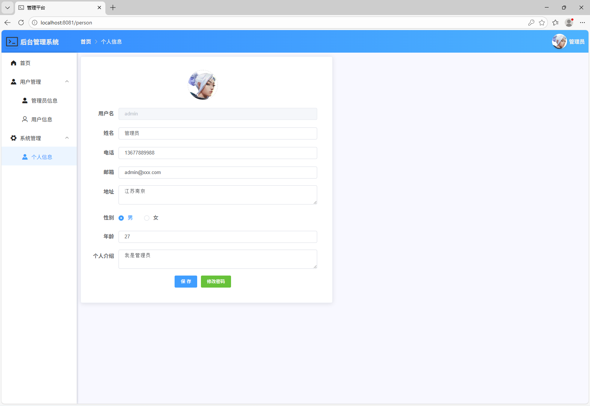

# 学生管理系统二次开发学习记录

基于一个开源的学生管理系统框架，我在此仓库记录自己添加新功能的整个过程。

## 项目背景
- 原框架：一个典型的 Vue + Spring Boot 学生信息管理系统
- 我的目标：通过二次开发，掌握全栈开发技能

## 我添加的功能（持续更新）

- **成绩管理模块**  
  实现了学生成绩的完整 CRUD（增删改查），支持按学生/科目查询、平均分计算。  
  后端：新增 Score 实体、Mapper、服务层、Controller 接口。  
  前端：score.vue 页面，使用 Element UI 表格 + 表单弹窗。  
  （对应开发顺序：2~6 模块，已完成）

- **登录功能增强**  
  添加图形验证码防止暴力破解，支持刷新验证码和登录失败提示。  
  后端：集成 EasyCaptcha 生成验证码接口，并在登录逻辑中校验。  
  前端：登录页面添加验证码输入框和图片，支持点击刷新。  
  （对应开发顺序：7 模块，进行中）

- **成绩统计图表（ECharts）**  
  在首页/统计页面添加可视化图表，展示班级平均分、成绩分布、及格率等。  
  后端：新增统计接口，返回聚合数据。  
  前端：集成 ECharts，绘制柱状图、饼图、折线图。  
  （对应开发顺序：8 模块，计划中）

## 学习进度打卡
- 2025-12-21：理解原框架结构，搭建学习仓
- 2025-12-22：数据库的建立
- 2025-12-23：课程界面功能的开发

## 功能预览（持续更新截图）

欢迎 star 和 fork，一起交流进步！
