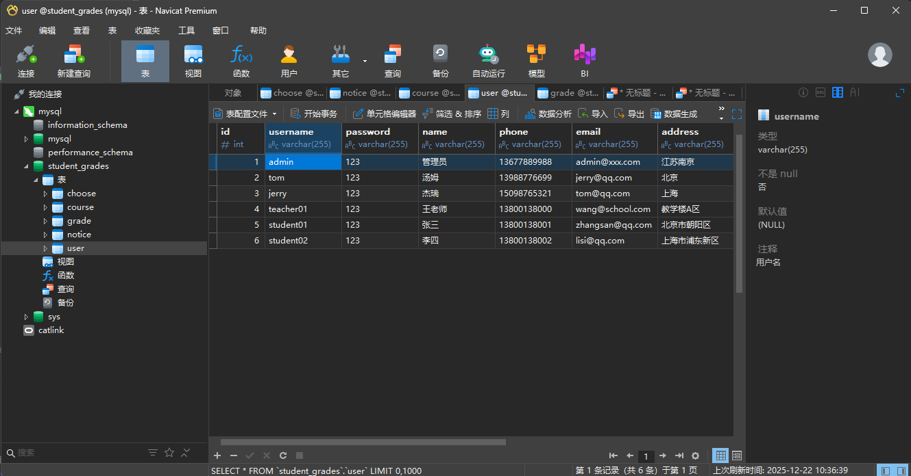
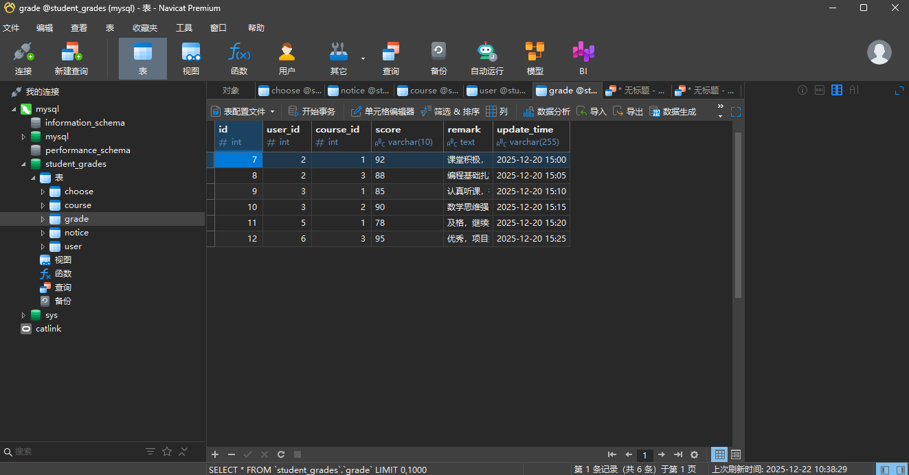
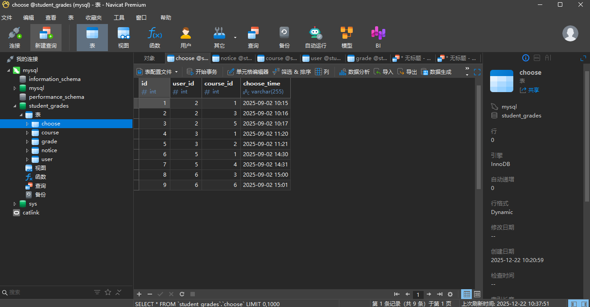
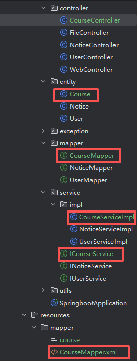
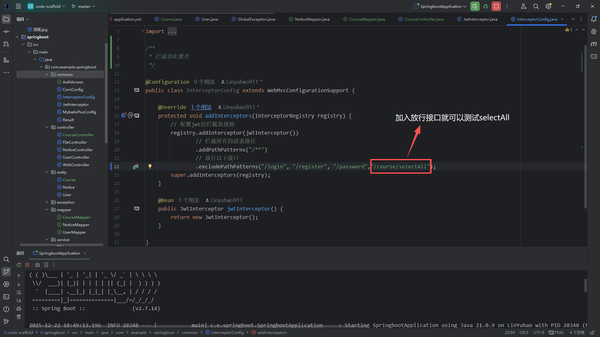
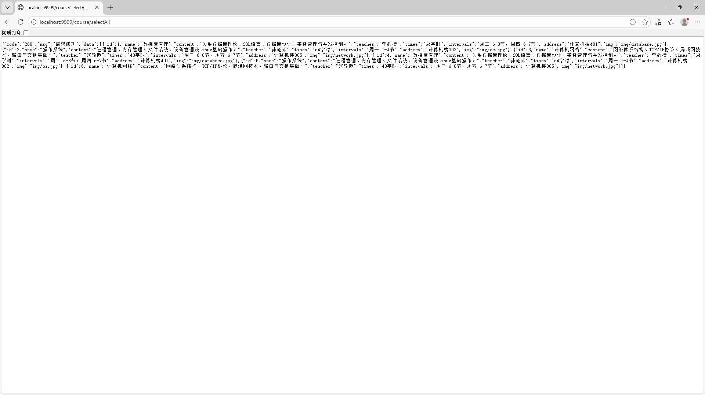

# Day2：数据库的建立和mybatis-plus的学习（2025-12-22）

## 1. mysql的表格






创建表（CREATE TABLE）基本语法

```sql
CREATE TABLE 表名 (
    字段名1 数据类型(长度) [约束] COMMENT '注释',
    字段名2 数据类型(长度) [约束] COMMENT '注释',
    ...
    PRIMARY KEY (主键字段),
    [其他索引或外键]
) ENGINE=InnoDB DEFAULT CHARSET=utf8mb4 COMMENT='表描述';
```
## 2. mybatis-plus的学习
让持久层代码真正“简洁优雅”

在开发后端项目时，持久层（DAO）代码往往是最重复、最繁琐的部分。传统 MyBatis 需要手写 XML、Mapper 接口、大量 CRUD 方法……直到我接触到 **MyBatis-Plus**（简称 MP），才真正体会到“代码简洁”的魅力。

## 为什么选择 MyBatis-Plus？

MyBatis-Plus 是对 MyBatis 的增强**不开箱即用、不改变原有特性**，却提供了大量开箱即用的功能：

- **零 SQL 实现 CRUD**
- **强大的条件构造器（Wrapper）**
- **内置分页、逻辑删除、乐观锁、自动填充等**
- **ActiveRecord 模式（可选）**
- **代码生成器（一键生成实体、Mapper、Service、Controller）**

### 最让我惊艳的“代码简洁”点

###查询优雅无比

传统方法：
需要写接口 + XML + 无数方法
一共要加以下这些文件 代码很繁琐


不再写繁琐的 Map 或 XML 条件：
只需要写一句
```java
@GetMapping("/selectAll")
public Result findAll() {
    return Result.success(courseService.list());
}
```
最后使用mybatis-plus一定要加依赖


## 3. Jwt的拦截

如没有给selectAll开放接口就可以出现下面的情况：


出现问题的原因：
这个项目使用了Jwt Jwt给它拦截了 没有携带token


解决方法：


成功界面：

