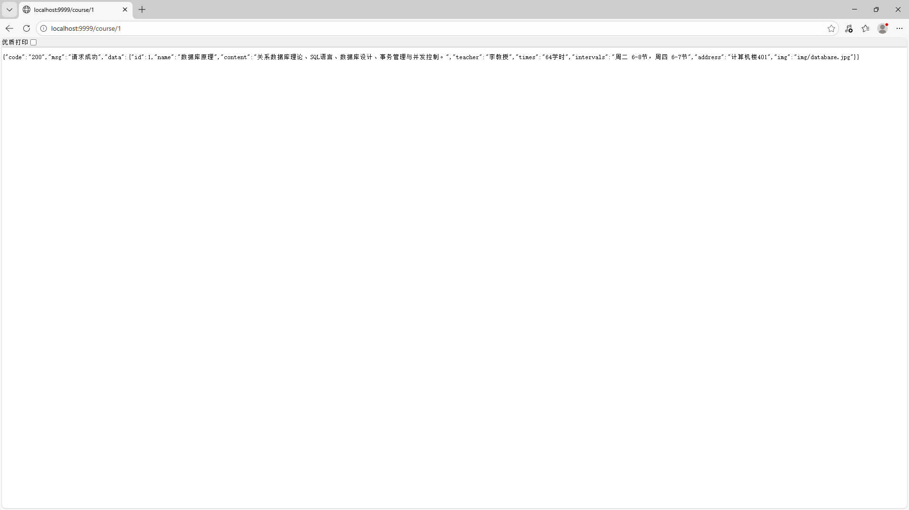
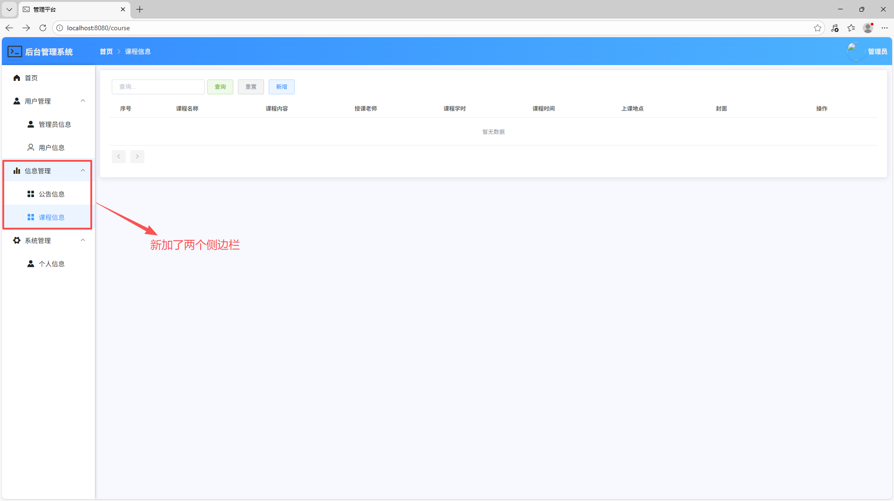
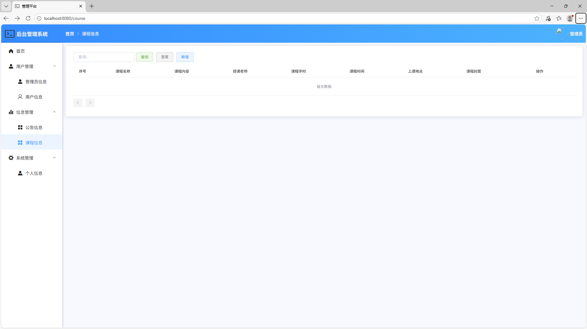
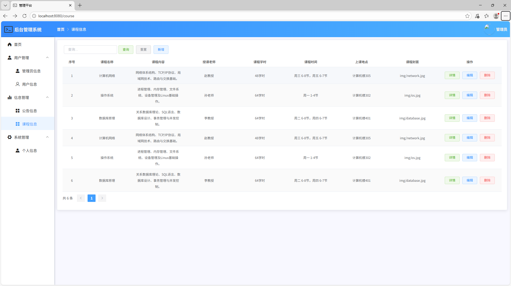
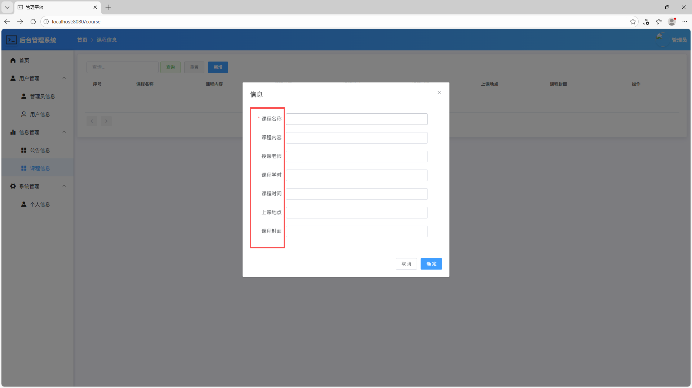
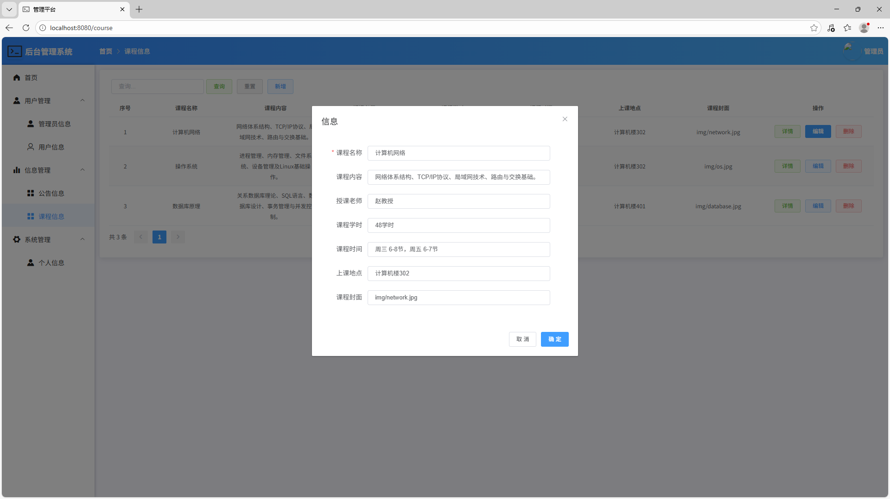
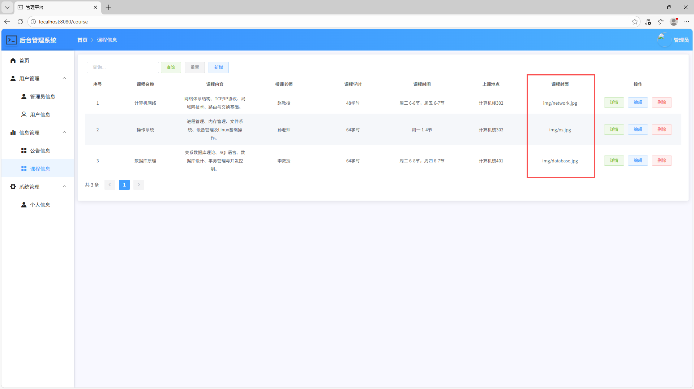
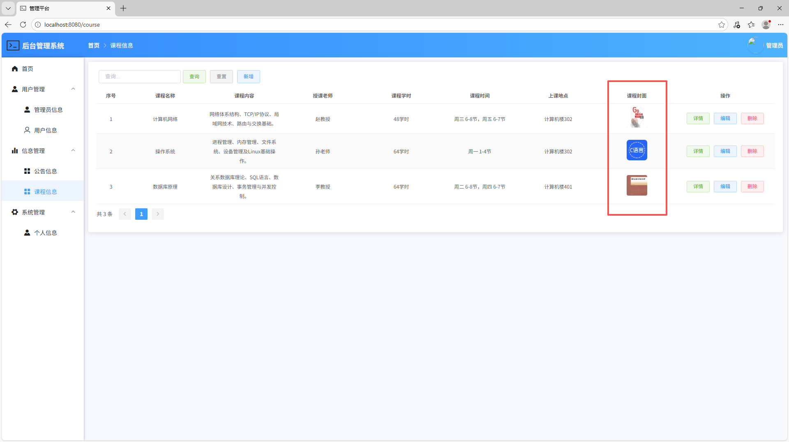

# day3: 开发课程vue页面(2025-12-23)

## 1. 查询course表的功能开发
查询成功界面：

## 2.添加侧边栏内容
在Course.vue文件中进行操作可以实现前端页面的功能：

## 3. 连接了数据库但Course表里面的信息并没有显示

说明接口还没有配置好！

## 4. 配置好接口后显示出了数据库的内容
配置好接口后显示出了数据库的内容：

## 5. 在vue文件中加入表单内容
表单内容：

## 6. 验证表单是否出现错误
表单正确：

## 7. 表格图片内容显示错误
错误显示：

## 8. 我在Element里面查找文件，发现upload可以解决这个问题
通过对vue的修改，实现了图片插入的显示：

